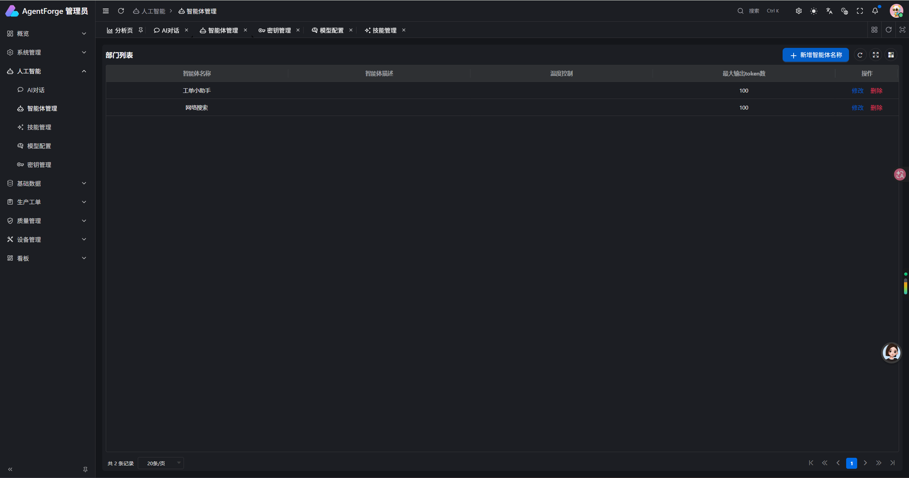
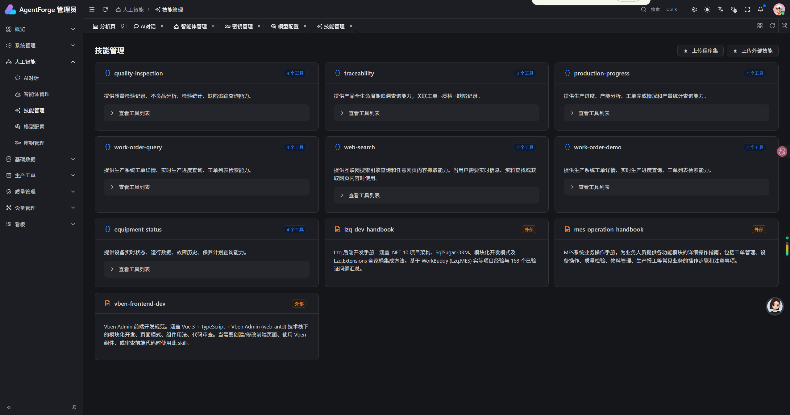
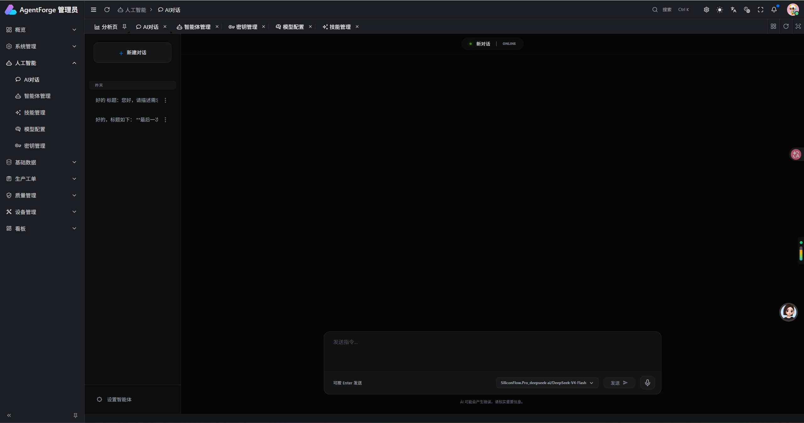
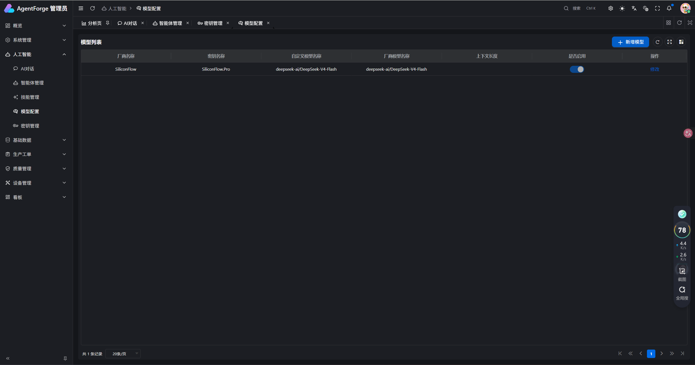
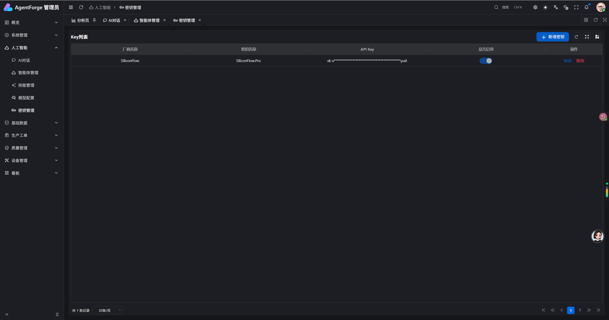
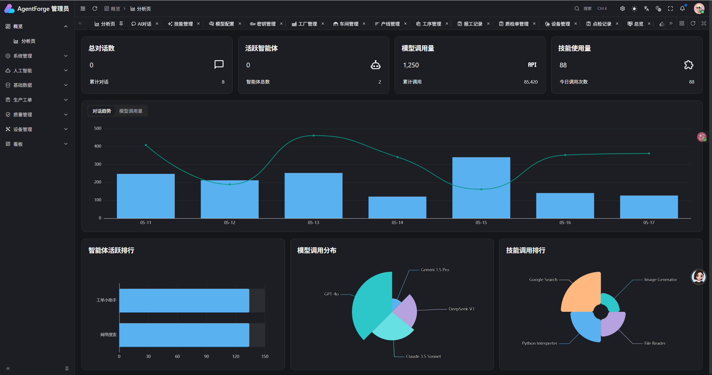

# Lzq.AgentForge — AI系统

基于 .NET 10 + Lzq.Extensions 构建的AI系统，通过 Agent 与 AgentSkill 解耦 的设计，为各类业务系统（MES、ERP、WMS、QMS…）提供统一的智能化 AI 操作入口。
当前以 MES（制造执行系统） 为演示实例，展示生产业务的智能对话、实时数据查询与流程辅助能力。

> 底层能力由`Lzq.Extensions扩展库` 提供，包含 ORM、缓存、认证、AI 技能引擎等 12 个扩展包。

---

🖥️ 在线演示
演示地址	http://106.54.42.201:5777/

---

## 🧠 核心理念：Agent + AgentSkill 解耦

``` text
  ┌───────────┐       ┌──────────────┐       ┌───────────────────┐
  │  AI Agent  │──────▶│ AgentSkill   │──────▶│ 业务系统 A (MES)    │
  │ (对话/推理) │       │ 技能层（挂载） │       │ 业务系统 B (ERP)    │
  │           │◀──────│ 标准化接口     │◀──────│ 业务系统 C (WMS)    │
  └───────────┘       └──────────────┘       └───────────────────┘
```

- **Agent 只负责交互与推理**，不直接耦合任何业务逻辑。
- **AgentSkill 是标准化的业务能力封装**，每个 Skill 可以接入一个或多个业务系统，提供 AI 可调用的工具和知识。
- 新业务系统只需开发对应的 Skill，即可获得智能对话、查询、操作能力，无需改动 Agent 核心。
- 当前平台已内置 **MES 业务技能**，并可快速扩展至其他系统。

---

## 🏗️ 整体架构

```
┌──────────────────────────────────────────────────────────────┐
│                    前端 SPA (Vben Admin)                       │
│           Vue 3 + TypeScript + Ant Design Vue                  │
└──────────────────────────────────────────────────────────────┘
                              │ HTTP REST / SSE (Streaming)
                              ▼
┌──────────────────────────────────────────────────────────────┐
│              Lzq.AgentForge.WebApi (Minimal APIs)             │
│                    .NET 10 Host Project                        │
│  ┌─────────────────────────────────────────────────────────┐ │
│  │          Lzq.Extensions 扩展库                        │ │
│  │  Core | SqlSugar | Redis | JWT | Serilog | NSwag         │ │
│  │  EventBus | RabbitMQ | HttpClient | AI ◄── 技能引擎       │ │
│  └─────────────────────────────────────────────────────────┘ │
└──────────────────────────────────────────────────────────────┘
         │              │              │              │
    ┌────▼────┐   ┌────▼────┐   ┌────▼────┐   ┌────▼────┐
    │WorkOrder│   │Equipment│   │   QA    │   │BaseData │
    │  模块   │   │  模块   │   │  模块   │   │  模块   │
    └────┬────┘   └────┬────┘   └────┬────┘   └────┬────┘
         │              │              │              │
    ┌────▼──────────────▼──────────────▼──────────────▼────┐
    │              Lzq.MES.Skills (AgentSkill 层)            │
    │  5 个业务技能 · 实时查询 · DI 注入 · GeneralSkill      │
    └───────────────────────────────────────────────────────┘
                              │
         ┌────────────────────┼────────────────────┐
    ┌────▼────┐          ┌────▼────┐          ┌────▼────┐
    │Internal │          │External │          │ Hot-Reload│
    │C# Skill │          │SKILL.md │          │ FileSystem│
    │  (DLL)  │          │  (ZIP)  │          │  Watcher  │
    └─────────┘          └─────────┘          └──────────┘
```

``` text

> AgentSkill 引擎、热加载等能力由 Lzq.Extensions.AI 提供

```

---

## 📂 解决方案结构

```
├── Lzq.AgentForge.WebApi/          # 🚀 启动宿主 · Program.cs 统一注册
│   ├── Extensions/                 # 健康检查等自定义扩展
│   ├── ExternalSkills/             # 📦 外部技能知识库
│   │   ├── lzq-dev-handbook/       #   后端开发手册（架构/模块/ORM/Redis…）
│   │   ├── mes-operation-handbook/ #   MES 业务操作手册（演示用）
│   │   └── vben-frontend-dev/      #   前端开发规范（组件/模式/审查清单）
│   ├── Data/                       # 种子数据
│   └── appsettings.json
│
├── Modules/                        # 🧩 业务模块（当前以 MES 为例）
│   ├── AI/                         # AI 智能体管理模块
│   ├── WorkOrder/                  # 工单管理
│   ├── Equipment/                  # 设备管理
│   ├── QA/                         # 质量管理
│   ├── BaseData/                   # 基础数据
│   ├── Dashboard/                  # 仪表盘
│   ├── Rbac/                       # 权限管理
│   └── Temp/                       # 临时/通用功能
│
├── Skills/Lzq.MES.Skills/           # 🤖 MES 业务技能示例（可扩展其他业务 Skill）
│   ├── QueryWorkOrderSkill.cs      # 工单查询技能
│   ├── ProductionProgressSkill.cs  # 生产进度技能
│   ├── EquipmentStatusSkill.cs     # 设备状态技能
│   ├── QualityInspectionSkill.cs   # 质检查询技能
│   └── TraceabilitySkill.cs        # 追溯查询技能
│
└── vue/admin/                      # 🎨 前端 (Vben Admin 5.6)
    └── apps/web-antd/              # Ant Design 版本
```
如需接入 ERP、WMS 等新业务系统，只需在实现 LzqAgentSkillBase，可直接引用到项目中直接运行，也可通过插件形式在技能管理上传DLL热加载，无需改动 Agent 核心代码。
也可以接入python等其他语言脚本，但需要在Lzq.Extensions.AI库实现对应脚本执行的Provider。
---

## 🤖 AI 模块详解

> 位置：`Modules\AI\`



*智能体管理：配置 Agent 名称、指令、温度/Token 参数，选择绑定的 Skill*



*技能管理：查看所有已加载技能（Internal C# + External Markdown），支持手动执行调试*



*AI 对话：选择 Agent + 模型，流式对话，Skill 自动调用*



*模型配置：支持 DeepSeek / SiliconFlow 等多厂商模型管理*



*API Key 管理：加密存储，支持多 Key 轮换*



*使用分析：对话趋势、技能调用统计、模型分布*

---

## 🧠 MES AgentSkill 业务技能

> 位置：`Skills\Lzq.MES.Skills\`

5 个已实现的 MES 业务技能，每个技能通过 DI 直接注入对应模块的业务服务，AI 可实时查询生产数据：

| 技能 | SkillName | 工具 | 能力 |
|------|-----------|------|------|
| **工单查询** | `work-order-query` | GetProgress / ListOrders / GetStatistics | 工单详情、多维度筛选、时段统计 |
| **生产进度** | `production-progress` | GetDailyProgress / GetLineProgress / GetCompletionRate / GetOutput | 日进度、产线进度、完成率、产量 |
| **设备状态** | `equipment-status` | GetStatus / GetOverview / ListFaults / GetUpcomingMaintenance | 设备详情、全局概览、故障/保养 |
| **质检查询** | `quality-inspection` | GetInspectionResult / GetDefectStats / ListDefects / GetDefectSummary | 质检单、不良率、缺陷分布 |
| **追溯查询** | `traceability` | GetFullTrace / GetDefectsByWorkOrder / GetQCByWorkOrder | 正向/反向完整追溯链路 |

**Skill 架构分层（L1-L4）：**

```
L1  SkillName + SkillDescription    → 技能元数据
L2  Instructions                    → AI 执行指引（何时调用哪个工具）
L3  [AgentSkillScript] 方法          → 可调用的工具（参数 + 描述）
L4  [AgentSkillResource] 静态属性    → 业务规则资源（状态码表、流转规则等）
```

**实际对话示例：**

> 👤 用户："注塑机A-01现在什么状态？有哪些维修记录？"
>
> 🤖 AI Agent 自动调用 `equipment-status.GetStatus("注塑机A-01")` → 发现状态为 UnderRepair
> → 自动调用 `equipment-status.ListFaults(priority="Urgent")` → 返回故障列表
> → 结合 `equipment-status-rules` 资源解释维修状态含义
> → 输出："注塑机A-01 当前状态为**维修中**，最近有一条紧急维修单…"

---

## 🔌 外部 Skill 知识库

目前已接入 3 个外部知识库 Skill：

### lzq-dev-handbook（后端开发手册）
### mes-operation-handbook（MES 业务操作手册）
### vben-frontend-dev（前端开发规范）

---

## 🎨 前端 — Vben Admin + 模块化

基于 **Vben Admin 5.6**（Vue 3 + TypeScript + Ant Design Vue），在标准框架基础上做了一轮模块化调整：

- **技术栈锁定**：仅使用 `@vben/*` + `ant-design-vue` 组件
- **页面模式复用**：4 种标准模式覆盖大部分 CRUD 场景
- **组件复用**：ApiSelect / ApiTreeSelect / DatePicker 等业务组件
- **权限 + 路由**：基于 Vben 的路由守卫和权限指令

---

## 🚀 启动命令

### 后端启动

```bash
cd Lzq.AgentForge.WebApi
dotnet restore
dotnet run --urls "https://localhost:5001;http://localhost:5000"

# 访问 Swagger UI
# https://localhost:5001/swagger （密码：默认mes123）
```

### 前端启动

```bash
# 确保 Node.js >= 18 + pnpm 已安装
cd vue/admin
pnpm install
pnpm run dev:antd

# 访问
# http://localhost:5777
```

### 一键启动（推荐）

```bash
# 后端
cd Lzq.AgentForge.WebApi && dotnet run

# 前端
cd vue/admin && pnpm run dev:antd
```

---

## 🧭 人主导 vs AI 主导 — 开发难度权衡矩阵

利用 **Skill + AI** 自动化开发系统，可以根据模块复杂度决定开发策略：

| 难度等级 | 模块示例 | 开发方式 | 说明 |
|----------|---------|----------|------|
| ⭐ 低 | 基础 CRUD（字典表、配置项） | **AI 全自动** | Skill+Codex等工具 一键生成 Entity → Repository → Service → API → 前端页面 |
| ⭐⭐ 中 | 简单业务（ApiKey 管理、模型配置） | **AI 主导 + 人审核** | AI 生成 90% 代码，人工补充业务规则和边界处理 |
| ⭐⭐⭐ 中高 | 标准业务（工单 CRUD、设备台帐） | **人机协作** | 人定义接口契约 + 复杂逻辑，AI 生成模板代码 + 测试用例 |
| ⭐⭐⭐⭐ 高 | 复杂业务（质检流程、追溯链路） | **人主导 + AI** | 核心流程人工设计，AI 辅助生成辅助代码（DTO 映射、分页查询、前端页面） |
| ⭐⭐⭐⭐⭐ 极高 | 核心引擎（AgentSkill 引擎、流式对话） | **人完全主导+AI** | 架构设计、协议实现、性能优化均需人工把控 |

### 利用 Skill 实现边界可控

```
              Lzq.Extensions 核心库
              ┌──────────────────────┐
              │  Core    SqlSugar    │
              │  Redis    JWT        │
              │  Serilog  NSwag      │
              │  EventBus RabbitMQ   │
              │  AI (AgentSkill)     │
              └──────────┬───────────┘
                         │ 严格分层 · 接口契约 · DI 注入
         ┌───────────────┼───────────────┐
         ▼               ▼               ▼
    MES Skill      后端开发 Skill     前端开发 Skill
   (业务知识)      (开发规范)        (组件规范)
         │               │               │
         └───────────────┼───────────────┘
                         ▼
              ┌──────────────────────┐
              │    AI 代码生成边界    │
              │  ✅ 只能使用 Skill 中  │
              │     定义的模式   │
              │  ❌ 不能引入新依赖     │
              │  ❌ 不能绕过权限/路由  │
              │  ❌ 不能修改框架层     │
              └──────────────────────┘
```

**核心原则**：AI 通过 `Lzq.Extensions` 扩展库暴露的接口 + `Skill` 定义的规范进行代码生成，确保：

1. **不引入新依赖** — 所有 NuGet 包在 Lzq.Extensions 中预定义
2. **不破坏架构** — 严格遵循项目架构分层、ServiceBase 约定
3. **模块隔离** — 每个模块相互独立，业务模块依赖只能通过Application.Contracts层
4. **安全性** — 外部 Skill 脚本执行已禁用，只读 Markdown 知识

---

## 📊 技术栈总结

| 层 | 技术 |
|---|------|
| 运行时 | .NET 10 |
| 数据库 | SqlSugar ORM + MySQL/PostgreSQL |
| 缓存 | Redis |
| 消息队列 | RabbitMQ |
| 日志 | Serilog（文件输出） |
| API 文档 | NSwag (Swagger) |
| 认证 | JWT |
| AI 框架 | Microsoft.Agents.AI + OpenAI |
| AgentSkill | LzqAgentSkillBase（C#）+ SKILL.md（外部） |
| 前端 | Vue 3 + TypeScript + Vben Admin 5.6 + Ant Design |
|核心基础设施   |	Lzq.Extensions扩展库  |

---

> **License**: Internal Use Only
>
> **架构理念**: 架构理念: 让 AI 成为业务系统的智能化操作层，而非外部工具。
通过 Agent 与 AgentSkill 解耦，将任意业务系统的能力标准化为 AI 可调用的技能，用外部 Skill 知识库约束知识边界，实现跨系统、可控制、可审计、可扩展的 AI-Native 操作平台。
当前 MES 仅为第一个落地的业务系统，该架构可无缝延伸至 ERP、WMS、PLM 等其他企业应用。
